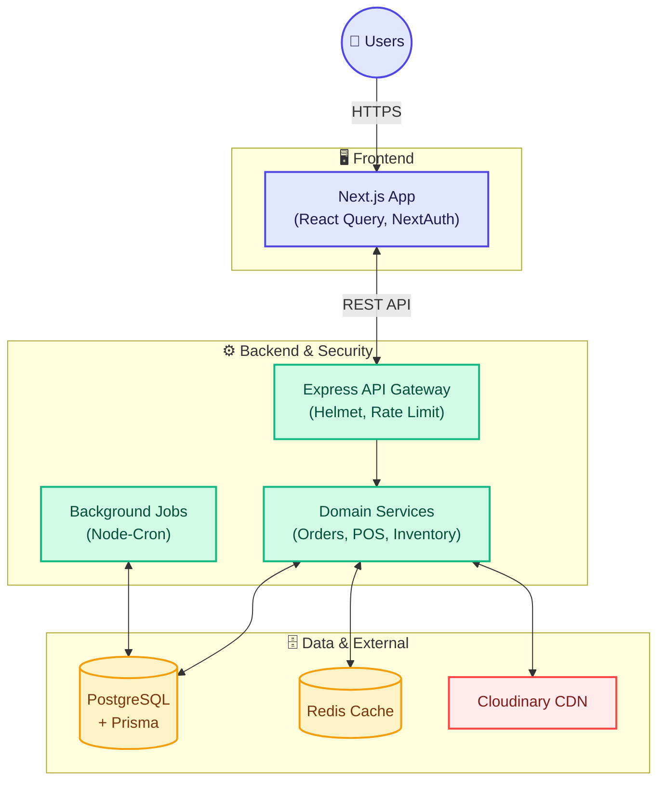

# Mouchak Cosmetics Platform

Mouchak Cosmetics is a comprehensive e-commerce and inventory management platform designed to handle online sales, POS operations, and multi-branch inventory logistics.

## 🌟 Key Features

- **E-Commerce Storefront**: Beautiful, responsive UI built with Next.js and Tailwind CSS.
- **Order Management**: End-to-end order tracking from placement to delivery, including returns and refunds.
- **Inventory & Multi-Branch Management**: Track stock levels across different warehouses and retail branches. Includes stock transfers and supplier transaction tracking.
- **Point of Sale (POS)**: Manual sales and return processing for staff.
- **Role-Based Access Control (RBAC)**: Fine-grained permissions for different user types (Customers, Admin, Staff).

## 🏗️ Architecture

Below is the high-level architecture diagram of the Mouchak Cosmetics platform:



## 📁 Folder Structure

The project uses a monorepo setup with a highly modularized, domain-driven architecture for both the frontend and backend.

```text
Mouchak Cosmetics/
├── client/                     # Next.js Frontend
│   ├── src/
│   │   ├── app/                # Next.js App Router (Pages & Layouts)
│   │   ├── modules/            # Domain-driven feature modules
│   │   │   ├── auth/           # Authentication UI & Logic
│   │   │   ├── cart/           # Shopping Cart & Checkout
│   │   │   ├── dashboard/      # Admin & Staff Dashboard
│   │   │   ├── products/       # Product Catalog
│   │   │   └── ...             # (categories, orders, inventory, etc.)
│   │   ├── shared/             # Shared components, hooks, and contexts
│   │   └── auth.ts             # NextAuth.js Configuration
│   └── package.json
│
├── server/                     # Node.js + Express Backend
│   ├── prisma/                 # Database schema and migrations
│   ├── src/
│   │   ├── config/             # App Configurations
│   │   ├── middleware/         # Express Middlewares (Auth, Error Handling)
│   │   ├── modules/            # Domain-driven feature modules
│   │   │   ├── auth/           # Authentication Controllers & Services
│   │   │   ├── orders/         # Order Management Logic
│   │   │   ├── inventory/      # Stock & Warehouse Logic
│   │   │   └── ...             # (products, analytics, customers, etc.)
│   │   ├── shared/             # Shared utilities (errors, validations)
│   │   └── app.ts              # Express App Entry
│   └── package.json
└── README.md
```

## 🛠️ Technology Stack

### Client (Frontend)
- **Framework**: Next.js 16
- **Styling**: Tailwind CSS v4
- **State Management / Data Fetching**: React Query
- **Animations**: Framer Motion
- **UI Components**: Lucide React, Recharts, SweetAlert2

### Server (Backend)
- **Runtime**: Node.js 20.x
- **Framework**: Express.js
- **Database ORM**: Prisma ORM
- **Database Engine**: PostgreSQL
- **Caching**: Redis
- **Authentication**: NextAuth.js (v5)
- **Media**: Cloudinary
- **Security**: Helmet, Express Rate Limit, CORS

## 🚀 Getting Started

### Prerequisites

- Node.js (v20+)
- PostgreSQL
- Redis Server
- Cloudinary Account (for media uploads)

### Installation

1. **Clone the repository:**
   ```bash
   git clone <repo-url>
   cd "Mouchak Cosmetics"
   ```

2. **Setup Backend:**
   ```bash
   cd server
   npm install
   # Create a .env file based on .env.example
   
   # Run migrations and seed database
   npm run db:migrate
   npm run db:seed
   
   # Start the development server
   npm run dev
   ```

3. **Setup Frontend:**
   ```bash
   cd ../client
   npm install
   # Create a .env.local file with necessary frontend variables
   
   # Start the frontend app
   npm run dev
   ```

## 📝 License

This project is licensed under the MIT License.
